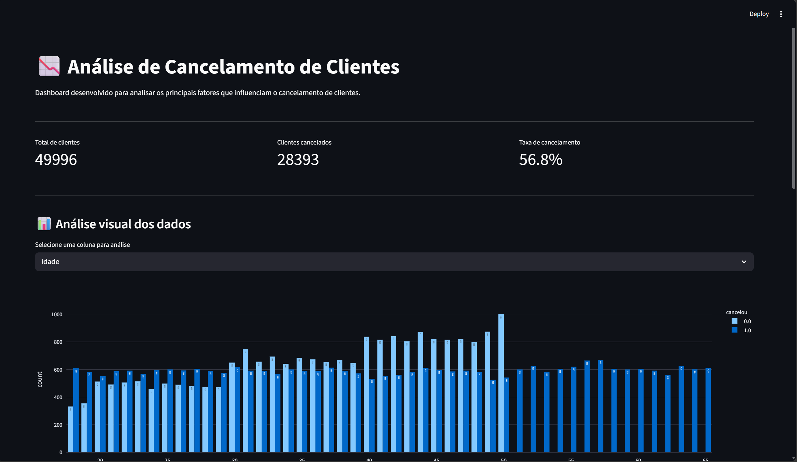

# 📉 Análise de Cancelamento de Clientes

Aplicação desenvolvida para analisar os principais fatores que influenciam o cancelamento de clientes.  
O projeto utiliza análise exploratória de dados (EDA) e visualizações interativas para identificar padrões de churn e gerar insights estratégicos para retenção.

---

## Tecnologias utilizadas

- Python
- Pandas
- Plotly
- Streamlit
- Análise de Dados

---

## Estrutura do projeto

```txt
Analise-cancelamento-clientes
 ┣ assets
 ┃ ┣ previewDashboard.png
 ┃ ┣ previewInsights.png
 ┃ ┗ dashboard-demo.gif
 ┃
 ┣ data
 ┃ ┗ cancelamentos.csv
 ┃
 ┣ notebooks
 ┃ ┗ analise_cancelamentos.ipynb
 ┃
 ┣ app.py
 ┣ requirements.txt
 ┗ README.md
```

---

## Funcionalidades

✔ Dashboard interativo com Streamlit  
✔ Visualização dinâmica dos dados  
✔ Análise exploratória de dados (EDA)  
✔ Identificação de padrões de cancelamento  
✔ Métricas de churn em tempo real  
✔ Geração de insights estratégicos  
✔ Simulação de redução de cancelamento  

---

## Como executar

```bash
pip install -r requirements.txt
streamlit run app.py
```

---

## Preview

### Dashboard principal

<p align="center">
  
</p>

---


### Demonstração do projeto

<p align="center">
  
</p>

---

## Principais insights

### Contratos mensais possuem maior taxa de cancelamento

Clientes com contrato do tipo **Monthly** apresentaram maior taxa de churn.

---

### Muitas ligações para o suporte aumentam o risco de cancelamento

Clientes com muitas ligações ao call center possuem maior probabilidade de cancelar o serviço.

---

### Clientes com atraso nos pagamentos tendem a cancelar

Clientes com muitos dias de atraso apresentaram forte tendência ao churn.

---

## Objetivo do projeto

Projeto desenvolvido para praticar e demonstrar conhecimentos em:

- Análise exploratória de dados
- Limpeza e tratamento de dados
- Visualização de dados
- Construção de dashboards interativos
- Identificação de padrões de comportamento
- Geração de insights estratégicos
- Tomada de decisão baseada em dados